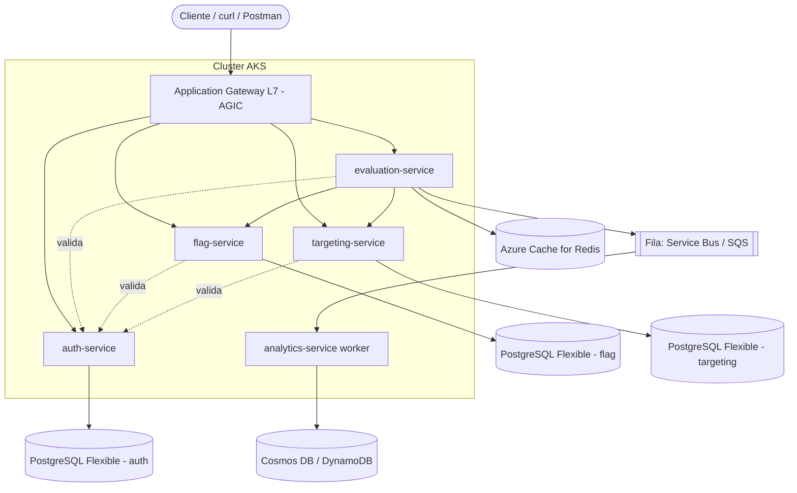

# Guia de Arquitetura — Tech Challenge Fase 2 (Migração para Azure / AKS)

> **Propósito deste documento**
> Servir de **mapa e roteiro** para o grupo iniciar e se orientar na migração do
> ToggleMaster (5 microsserviços) para Kubernetes na **Azure (AKS)**, mantendo um
> ambiente de **desenvolvimento local com Docker Compose**.
>
> Este é um **guia de tutor**: ele aponta o *caminho*, as *decisões* que vocês
> precisam tomar e as *perguntas* que precisam responder. Ele **não traz o código
> pronto** (Dockerfiles, manifestos YAML, pipelines). A construção é de vocês — é
> nela que está o aprendizado avaliado.

---

## 1. Onde vocês estão e o que o desafio pede

O enunciado da Fase 2 (PDF) descreve o desafio usando a stack **AWS** como
exemplo (EKS, ECR, RDS, ElastiCache, DynamoDB, SQS). Mas o próprio enunciado
**autoriza explicitamente** a Opção B — conta pessoal em **Azure (AKS)** — e diz
que é o caminho profissional recomendado.

Vocês decidiram:

- **Nuvem:** Azure
- **Orquestração:** AKS (Azure Kubernetes Service)
- **CI/CD:** Azure DevOps (Pipelines)
- **Registro de imagens:** Azure Container Registry (ACR)
- **Dados:** serviços gerenciados da Azure
- **Dev local:** Docker Compose (obrigatório pelo enunciado — provar que o ecossistema roda local)

A aplicação são **5 microsserviços** (resumo a partir dos READMEs):

| Serviço | Linguagem | Papel | Dependência de dados |
|---|---|---|---|
| `auth-service` | Go | Cria/valida chaves de API (MASTER_KEY) | PostgreSQL |
| `flag-service` | Python (Flask) | CRUD das feature flags; exige Bearer token do auth | PostgreSQL |
| `targeting-service` | Python (Flask) | Regras de segmentação (ex.: PERCENTAGE 50%) | PostgreSQL |
| `evaluation-service` | Go | *Hot path*: decide true/false; cacheia e emite evento | Redis + Fila de mensagens |
| `analytics-service` | Python (worker) | Consome eventos da fila e grava análise | Fila de mensagens + NoSQL |

Fluxo de dependência (entendam isto **antes** de qualquer YAML):

```
Cliente ──> evaluation-service ──> flag-service ─────┐
                  │                 targeting-service ─┤──> (todos validam no) auth-service
                  │                                    │
                  ├──> Redis (cache)                   
                  └──> Fila ──> analytics-service ──> NoSQL
```

> **Pergunta-guia:** se o `auth-service` cair, quais serviços param? E se o
> `flag-service` cair, o `evaluation-service` ainda responde? (Dica: olhem o
> papel do cache no README do evaluation.) Respondam isso em grupo — define a
> ordem de subida e os *probes*.

---

## 2. ⚠️ A decisão mais importante do projeto (não pulem esta seção)

O código-fonte que vocês receberam foi escrito para **AWS**:

- `evaluation-service` **produz** mensagens numa fila **AWS SQS** e usa variáveis `AWS_SQS_URL`, `AWS_REGION`.
- `analytics-service` **consome** do **AWS SQS** e grava no **AWS DynamoDB** (tabela `ToggleMasterAnalytics`, partition key `event_id`), usando credenciais AWS.

Vocês escolheram **dados focados na Azure**. Isso cria uma bifurcação que **o
grupo precisa decidir conscientemente**, porque muda o tamanho do trabalho:

- **Caminho 1 — Refatorar para serviços nativos Azure.**
  Trocar a fila por **Azure Service Bus** (ou Storage Queue) e o NoSQL por
  **Azure Cosmos DB**. Exige alterar o código Go e Python (SDKs, variáveis de
  ambiente, autenticação). É o caminho mais "Azure puro" e mais rico para
  aprender.
- **Caminho 2 — Manter fila/NoSQL na AWS e o resto na Azure (híbrido).**
  Menos código alterado, mas vocês passam a gerenciar duas nuvens e a explicar
  no vídeo por que o ambiente é misto.

> **Não vou decidir isto por vocês.** Mas, para escolher bem, respondam:
> 1. Quanto tempo o grupo tem? Refatorar SDK de fila/NoSQL consome dias.
> 2. O enunciado pede explicar "a diferença de propósito entre os 3 *data stores*". Vocês conseguem defender essa explicação com os serviços Azure equivalentes?
> 3. Alguém do grupo domina Go o suficiente para mexer no `evaluation-service`?
>
> Tomem essa decisão **na primeira reunião** e registrem no relatório. Tudo o que
> vem depois depende dela.

---

## 3. Mapa de equivalência AWS → Azure

Use esta tabela para "traduzir" cada item do checklist do PDF para a Azure. Ela
diz **o quê** usar; o **como configurar** é o que vocês vão pesquisar e documentar.

| No enunciado (AWS) | Equivalente Azure | Observação para pesquisar |
|---|---|---|
| EKS (cluster K8s) | **AKS** | Comecem com 1 cluster, node pool pequeno (2 nós). |
| ECR (registro) | **Azure Container Registry (ACR)** | É possível **anexar o ACR ao AKS** para o pull sem secret manual — pesquisem isso. |
| RDS PostgreSQL ×3 | **Azure Database for PostgreSQL – Flexible Server** ×3 | Um por serviço (auth/flag/targeting), como pede o PDF. |
| ElastiCache Redis | **Azure Cache for Redis** | Para o `evaluation-service`. |
| DynamoDB | **Azure Cosmos DB** | Para o `analytics-service`. Decidam a API (NoSQL vs Table) e a partition key. |
| SQS (fila) | **Azure Service Bus** (queue) ou **Storage Queue** | Produtor: evaluation. Consumidor: analytics. |
| IAM Roles / IRSA | **Microsoft Entra Workload Identity** (Managed Identity) | É o equivalente azure ao IRSA para dar permissão a pods sem chave fixa. |
| Application Load Balancer (L7) | **Azure Application Gateway** (via **AGIC** ou **Application Gateway for Containers**) | **Decisão do grupo (orientação do professor): usar um Application Load Balancer gerenciado, NÃO o Nginx Ingress.** Na Azure o L7 gerenciado é o Application Gateway; o AGIC o expõe como `Ingress` do K8s. Pesquisem AGIC (add-on) vs. Application Gateway for Containers (mais novo). |
| HPA (CPU) | **HPA** (idêntico) | Precisa do **Metrics Server** (no AKS já costuma vir habilitado — confirmem). |
| KEDA | **KEDA** — *add-on nativo do AKS* | Vantagem grande da Azure: o scaler de fila do KEDA é a forma "correta" de escalar o analytics por profundidade de fila. |
| CodePipeline/console | **Azure DevOps Pipelines** | CI (build+push pro ACR) e CD (deploy no AKS). |

> **Observação de tutor:** o enunciado trata KEDA como "opcional/recomendado"
> porque na AWS Academy ele não funciona (limitação de IAM). **Na Azure vocês não
> têm essa limitação** — então escalar o `analytics-service` por **profundidade da
> fila** com KEDA é totalmente viável e rende ótima nota/explicação no vídeo.
> Pensem se querem ir além do HPA por CPU.

---

## 4. Arquitetura alvo (visão de produção no AKS)



> **Exercício:** desenhem essa figura vocês mesmos (no Excalidraw/Draw.io) e
> marquem **quais setas atravessam a fronteira do cluster** (vão para serviços
> gerenciados). Essas setas são exatamente os pontos onde vocês vão precisar de
> **Secrets** (strings de conexão) e de **rede/firewall**. Entender isso evita 80%
> dos erros de "conecta local mas não conecta no cluster".

---

## 5. Roteiro por fases (o caminho recomendado)

Sigam **nesta ordem**. Cada fase entrega algo verificável e desbloqueia a
próxima. Em cada fase listo o **objetivo**, as **perguntas que vocês devem
responder** e o **critério de pronto** — mas a implementação é de vocês.

### Fase 0 — Organização e fundação (Azure DevOps)
**Objetivo:** ter onde versionar, planejar e automatizar.
- Criem a organização/projeto no **Azure DevOps**; decidam estrutura de repositório (mono-repo com 5 pastas vs 5 repos — os serviços já vêm com `.git` separado; discutam o trade-off).
- Criem um board simples (cards por fase) e dividam responsáveis.
- **Critério de pronto:** todos com acesso, repositório com o código atual commitado.

> **Pergunta-guia:** o enunciado pede "link dos repositórios" no relatório. Mono-repo
> ou multi-repo muda como vocês vão estruturar os *pipelines* na Fase 7. Decidam já.

### Fase 1 — Rodar tudo local com Docker Compose
**Objetivo:** provar que o ecossistema funciona na máquina de vocês (entregável obrigatório: `docker compose up` com os 9 contêineres = 5 apps + 4 dados).
- Estudem cada README de serviço: portas, variáveis `.env`, dependências.
- O `docker-compose.yaml` atual **está incompleto/inconsistente** — usem-no como ponto de partida crítico, não como verdade. Verifiquem por conta própria:
  - Ele referencia contextos `./db-auth`, `./db-flag`, `./db-targeting` e `./analytics-services` (com "s") — **essas pastas existem?** Os nomes batem com as pastas reais?
  - **Não há Redis** nem um **emulador de NoSQL/fila** declarados. O enunciado exige 4 *data stores* locais (2 PostgreSQL, 1 Redis, 1 NoSQL local).
  - As portas internas (`30000`, `30001`...) batem com a porta que cada app realmente escuta nos READMEs (`8001`–`8005`)?
  - `dockerfile` vs `Dockerfile` — atenção a maiúsculas/minúsculas.
- Pesquisem **emuladores locais** para não depender da nuvem no dev: emulador do **Cosmos DB** e **Azurite** (Storage Queue), ou o **DynamoDB Local** se mantiverem AWS no Caminho 2.

> **Perguntas-guia:**
> - Em que ordem os serviços precisam subir? (Releiam a Fase 1 da seção 1.) Como o `depends_on` e os *healthchecks* ajudam?
> - Como o `auth-service` vai gerar a primeira chave para os outros? (O README do evaluation explica o passo da `MASTER_KEY`.) Como automatizar isso no compose?
>
> **Critério de pronto:** `docker compose up` sobe tudo, `curl .../health` responde `ok` em cada serviço, e vocês conseguem rodar o fluxo de teste ponta a ponta dos READMEs (criar flag → criar regra → avaliar → ver evento no analytics).

### Fase 2 — Conteinerização caprichada (Dockerfiles)
**Objetivo:** imagens prontas para produção.
- Cada serviço precisa de um **Dockerfile** (já existem; revisem criticamente).
- O enunciado pede **multi-stage build** (especialmente os serviços Go — imagem final pequena, sem o toolchain). Pesquisem o porquê (tamanho, superfície de ataque, velocidade de pull).
- **Critério de pronto:** `docker build` de cada serviço gera imagem que roda; imagens Go ficam pequenas (comparem antes/depois do multi-stage).

### Fase 3 — Provisionar a infraestrutura Azure
**Objetivo:** ter a nuvem pronta antes de implantar. Espelha o "checklist de infraestrutura" do PDF, traduzido na seção 3.
- Provisionem (portal Azure ou Azure CLI): **AKS**, **ACR**, **3× PostgreSQL Flexible**, **Azure Cache for Redis**, **Cosmos DB**, **fila** (Service Bus/Storage Queue).
- **Anotem todas as strings de conexão / endpoints / chaves** — vocês vão injetá-las como *Secrets* na Fase 5. (O PDF reforça isso.)
- Decidam **rede**: os bancos vão aceitar conexão de onde? (Firewall, VNet integration, private endpoint.) Esse é um ponto onde grupos travam.
- **Critério de pronto:** cluster `kubectl get nodes` responde; ACR criado e **anexado ao AKS**; cada *data store* acessível e com credenciais anotadas em local seguro (NÃO comitem isso).

### Fase 4 — Publicar imagens no ACR
**Objetivo:** as imagens da Fase 2 disponíveis para o cluster.
- Façam build + tag + push das 5 imagens para o ACR.
- **Critério de pronto:** as 5 imagens aparecem no ACR e o AKS consegue dar *pull* (testem um deploy simples).

### Fase 5 — Manifestos Kubernetes
**Objetivo:** descrever a aplicação no cluster. O PDF lista exatamente o que escrever:
- **Namespaces** (separem por serviço/domínio — boa prática exigida).
- **Deployment** por serviço (apontando para a imagem no ACR).
- **Service** ClusterIP por serviço.
- **Secrets** (strings de conexão, chaves, MASTER_KEY) — lembrem que o conteúdo vai em **base64**.
- **ConfigMap** (URLs internas entre serviços, regiões, nomes de fila/tabela).
- Boas práticas **obrigatórias** no enunciado: `requests`/`limits` de CPU e memória, `readinessProbe`/`livenessProbe` (vocês já têm `/health` em todos!).

> **Perguntas-guia:**
> - Como um serviço encontra o outro dentro do cluster? (DNS interno do K8s — qual o nome?) Isso substitui os `http://localhost:800X` dos READMEs.
> - Onde entra a **Workload Identity** se vocês quiserem que o pod do analytics acesse a fila/NoSQL **sem chave fixa**? (Equivalente Azure do IRSA.)
>
> **Critério de pronto:** `kubectl get pods` mostra os 5 rodando e `Ready`; *probes* verdes.

### Fase 6 — Acesso externo (Application Load Balancer L7)
**Objetivo:** expor a aplicação por um **Application Load Balancer gerenciado** (orientação do professor) — **não** Nginx Ingress.
- Na Azure isso é o **Azure Application Gateway** integrado ao AKS pelo **AGIC** (Application Gateway Ingress Controller) — habilitado como **add-on do AKS** — ou pelo mais novo **Application Gateway for Containers**. Pesquisem qual usar e habilitem-no.
- Mesmo com o ALB gerenciado, vocês ainda escrevem **um objeto `Ingress`** do K8s: é ele que o AGIC lê para configurar as rotas no Application Gateway. As regras: `/auth` → auth-service, `/flags` → flag-service, etc. (o analytics é *worker*, sem rota pública — só `/health`).
- Pesquisem o que o Application Gateway exige na **rede**: ele costuma viver numa **subnet dedicada** da mesma VNet do AKS. Planejem isso junto da Fase 3.
- **Critério de pronto:** `curl http://<IP-publico-do-Application-Gateway>/...health` responde de fora do cluster, com o roteamento por path funcionando.

> **Pergunta-guia:** qual a diferença entre o *controller* rodar **dentro** do
> cluster (Nginx) e o balanceador ser um **recurso gerenciado fora** dele
> (Application Gateway)? Pensem em quem aplica patch, quem escala e onde termina a
> TLS. Tenham essa resposta para o vídeo — justifica a escolha do professor.

### Fase 7 — Escalabilidade (HPA e/ou KEDA)
**Objetivo:** atender o requisito de escalonamento e a demonstração do vídeo.
- **Mínimo (espelha Opção A do PDF):** `HorizontalPodAutoscaler` para `evaluation-service` (CPU ~70%) e para `analytics-service` (CPU). Exige **Metrics Server**.
- **Recomendado (Opção B / vantagem Azure):** **KEDA** (add-on do AKS) com um `ScaledObject` no `analytics-service` escalando por **profundidade da fila** (de 0 a N) — muito mais alinhado ao padrão *event-driven*.
- **Critério de pronto:** sob carga, `kubectl get hpa` e `kubectl get pods` mostram réplicas subindo.

> **Pergunta-guia:** o vídeo pede *justificar* a escolha (CPU vs fila). Qual métrica
> representa melhor a carga real de um *worker* de fila? Tenham a resposta pronta.

### Fase 8 — CI/CD no Azure DevOps
**Objetivo:** automatizar build→push→deploy.
- **Pipeline de CI:** build das imagens + push para o ACR (a cada commit/PR).
- **Pipeline/stage de CD:** aplicar os manifestos no AKS.
- Pesquisem **service connections** do Azure DevOps para ACR e AKS, e como guardar segredos (variable groups / Key Vault) — **nada de credencial no YAML**.
- **Critério de pronto:** um commit dispara o pipeline e atualiza o cluster sem passos manuais.

### Fase 9 — Entregáveis
Conferir contra a seção 6 deste guia antes de gravar.

---

## 6. Checklist de entregáveis (mapeado ao PDF)

Vídeo (até 20 min) precisa mostrar:
- [ ] `docker compose up` com os **9 contêineres** rodando local.
- [ ] Cluster **AKS** provisionado.
- [ ] Os **5 microsserviços** como Pods (`kubectl get pods`).
- [ ] **Application Load Balancer (Application Gateway L7)** funcionando (chamada `curl`/Postman ao IP público do gateway, roteando por path).
- [ ] Carga no `evaluation-service` (`hey`/`ab`/Postman) → **HPA** subindo réplicas.
- [ ] Várias mensagens na **fila** → HPA/**KEDA** do `analytics-service` escalando.
- [ ] Dados aparecendo no **NoSQL** (Cosmos/DynamoDB).
- [ ] Explicação da **arquitetura** e dos **desafios** (ex.: o que mudou ao sair de AWS para Azure).
- [ ] Justificativa da estratégia de escala do analytics (CPU vs fila).
- [ ] Diferença de **propósito** entre os 3 *data stores* (relacional vs cache vs NoSQL).

Relatório (.pdf/.txt):
- [ ] Nomes, RM e usernames do Discord.
- [ ] Links dos repositórios (Azure DevOps).
- [ ] Link do vídeo (YouTube ou similar).
- [ ] (Opcional, +10 pts) badge público da trilha Google Cloud Skills Boost.

---

## 7. Referência rápida — portas e dados locais

Do que os READMEs definem (confiram ao montar o compose):

| Serviço | Porta (host) | Precisa de | Variáveis-chave |
|---|---|---|---|
| auth-service | 8001 | PostgreSQL | `DATABASE_URL`, `MASTER_KEY`, `PORT` |
| flag-service | 8002 | PostgreSQL + auth | `DATABASE_URL`, `AUTH_SERVICE_URL`, `PORT` |
| targeting-service | 8003 | PostgreSQL + auth | `DATABASE_URL`, `AUTH_SERVICE_URL`, `PORT` |
| evaluation-service | 8004 | Redis + fila + auth/flag/targeting | `REDIS_URL`, `FLAG_SERVICE_URL`, `TARGETING_SERVICE_URL`, `SERVICE_API_KEY`, fila |
| analytics-service | 8005 | fila + NoSQL | fila, tabela NoSQL, região, `PORT` |

> Lembrete: `SERVICE_API_KEY` do evaluation é uma chave criada **no auth** com a
> `MASTER_KEY`. Pensem em como o ambiente (local e cluster) obtém essa chave de
> forma reproduzível.

---

## 8. Armadilhas comuns (aprendam com elas antes de cair)

- **"Funciona local, falha no cluster":** quase sempre é (a) `localhost` em vez do DNS interno do K8s, ou (b) firewall/rede do banco gerenciado bloqueando o AKS. Revisem a seção 4.
- **Secrets comitadas:** nunca subam `.env`, strings de conexão ou `MASTER_KEY` ao repositório. Usem `.gitignore` e os mecanismos de segredo do Azure DevOps/K8s.
- **Esquecer o Metrics Server:** sem ele, o HPA fica com `<unknown>` de CPU e não escala.
- **Imagens AWS-SDK rodando contra Azure:** se escolherem o Caminho 1 (seção 2) e não refatorarem, a fila/NoSQL simplesmente não conecta. Decidam cedo.
- **Compose com 9 contêineres ≠ 9 serviços quaisquer:** são 5 apps + 4 *data stores* específicos. Conferir o requisito literal.
- **Probes apontando para porta/rota errada:** todos têm `/health` — usem.

---

## 9. Sugestão de divisão de trabalho no grupo

Não é regra; é um ponto de partida para vocês adaptarem:

- **Trilha A — Aplicação/local:** Dockerfiles multi-stage + docker-compose completo + fluxo de teste ponta a ponta (Fases 1–2).
- **Trilha B — Infra Azure:** AKS, ACR, bancos, fila, rede e Workload Identity (Fase 3–4).
- **Trilha C — Kubernetes:** namespaces, deployments, services, secrets/configmaps, ingress, HPA/KEDA (Fases 5–7).
- **Trilha D — CI/CD + entrega:** pipelines Azure DevOps, gravação do vídeo, relatório (Fases 0, 8–9).

As trilhas se encontram nos *contratos*: portas, nomes de Service, nomes de Secret/ConfigMap. **Combinem esses nomes cedo** para trabalharem em paralelo sem conflito.

---

## 10. O que estudar antes de começar cada fase (mínimo)

- **Docker:** multi-stage build, redes e `depends_on`/healthcheck no Compose.
- **Azure:** AKS, ACR (e *attach* ao AKS), PostgreSQL Flexible Server, Azure Cache for Redis, Cosmos DB, Service Bus/Storage Queue, Workload Identity, **Application Gateway + AGIC** (e a subnet dedicada na VNet).
- **Kubernetes:** Pod/Deployment/Service/Ingress, ConfigMap vs Secret, requests/limits, liveness/readiness, HPA; e **KEDA** (ScaledObject, scaler de fila).
- **Azure DevOps:** Pipelines (YAML), service connections, variable groups/Key Vault.

---

### Lembrete final do tutor
Tratem este documento como o **mapa**, não como o **destino**. Cada "Critério de
pronto" é uma checagem que vocês mesmos fazem. Quando travarem, voltem às
**perguntas-guia** — elas costumam apontar a resposta antes de qualquer tutorial.
Boa jornada. 🚀
